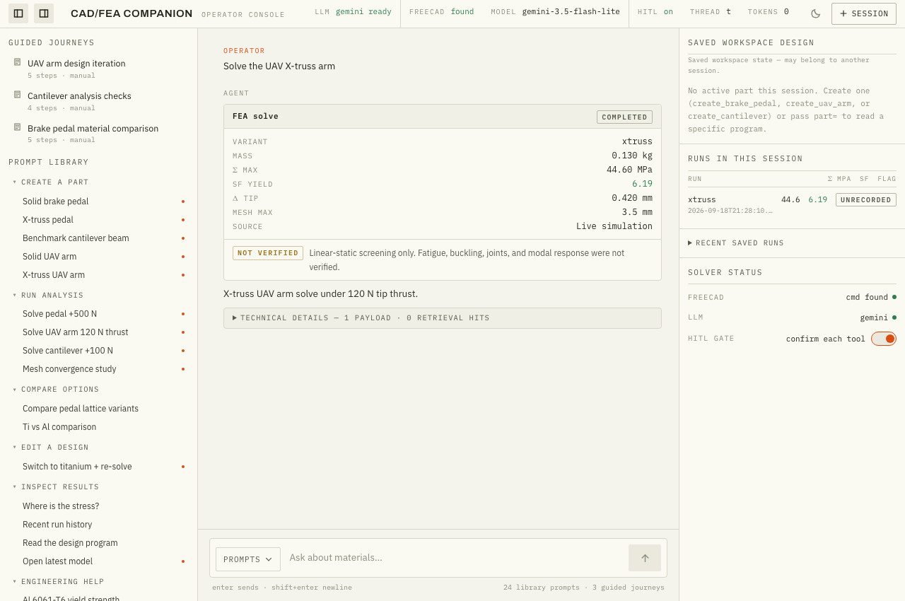
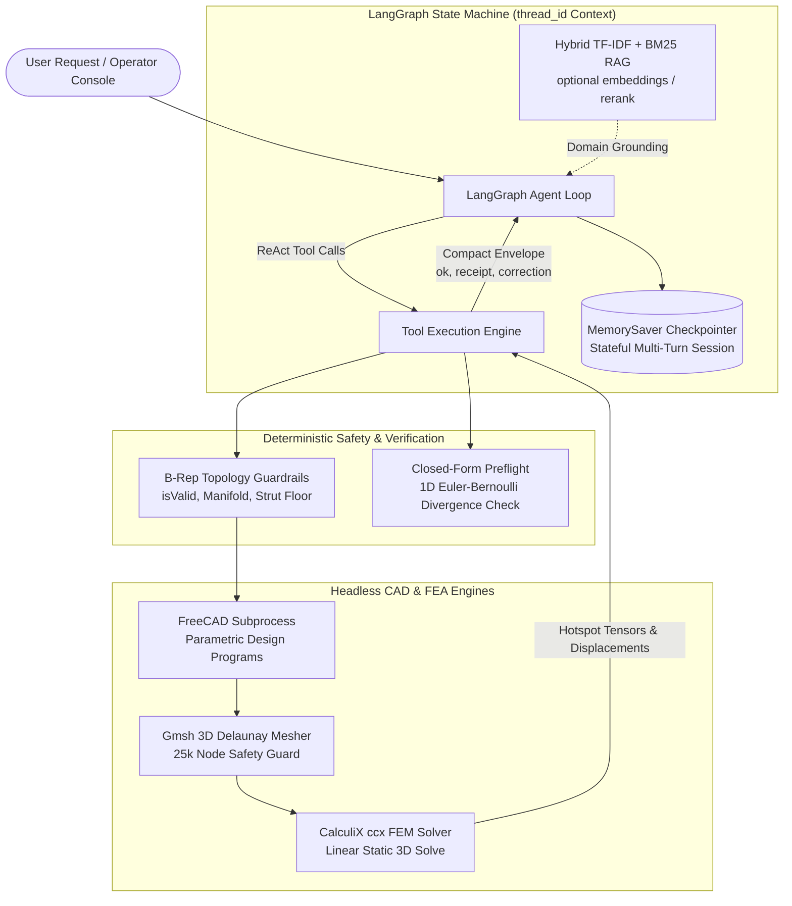
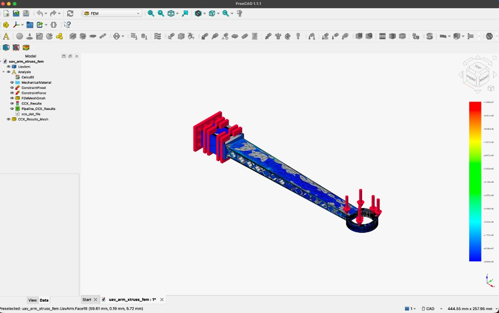
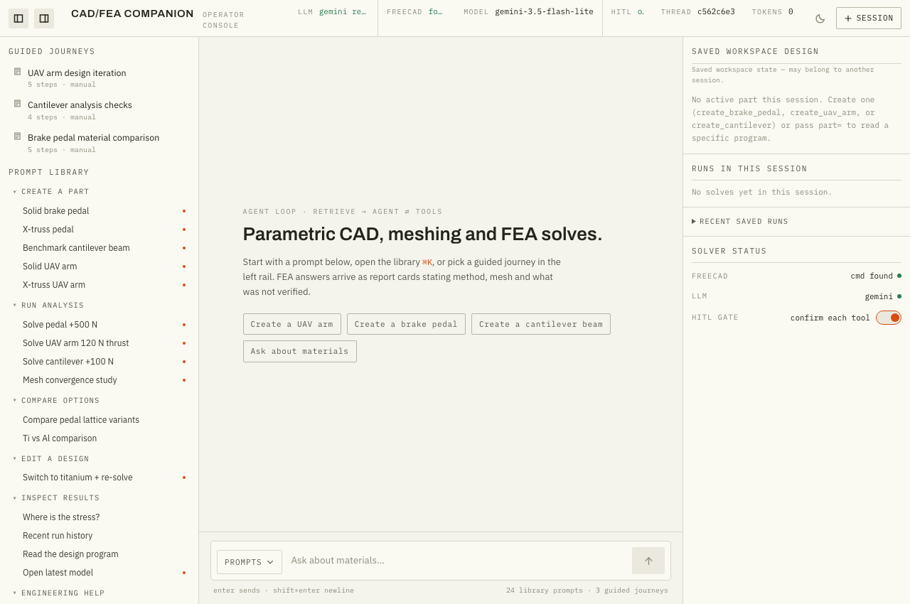

# CAD/FEA Chat Companion

> **An agentic engineering assistant for parametric CAD and linear-static FEA.**

[](https://github.com/rahulkeswani13/cad-fea-companion/actions/workflows/ci.yml)
[](requirements.txt)
[](companion/tools/)
[](LICENSE)

Natural language in the operator console drives parametric design programs, Gmsh meshing, and CalculiX **linear-static** solves. Every result states its method, mesh size when applicable, and what was **not** verified. This is screening FEA, not certification, and not a closed-loop optimizer.



*React console at `/app`: report cards show origin (live / estimate / fallback), KPIs, and **NOT VERIFIED** caveats.*

**89 behavior evals + 366 unit/integration tests + 66 browser checks gate every push — at zero API cost** (LLM-backed paths fall back to deterministic routing in CI; model-judged evaluations are explicit local opt-ins).

A LangGraph agent loop orchestrates hybrid **TF-IDF + BM25** retrieval (optional pinned local embeddings and cross-encoder rerank, with visible lexical fallback), geometric guardrails, and a compact tool outcome envelope (one error + one correction). Retrieval and claim-evidence checks are not engineering verification.

Independent RAG evaluation (reranked profile) vs the committed bar: answerable recall@4 **0.80 / 0.90**, critical recall@4 **0.775 / 1.00**; answer behavior **0.40 / 0.90**, supported factual claims **0.439 / 0.95**. The experiment improved retrieval and left an inspectable workflow; it did not meet those targets. See [`eval/reports/rag_acceptance_summary.json`](eval/reports/rag_acceptance_summary.json).

---

## AI Engineering Architecture

See [`docs/reference/ARCHITECTURE.md`](docs/reference/ARCHITECTURE.md) for the 5-layer writeup.



### Core AI Engineering Patterns

1. **Design Programs as Source of Truth ([`companion/tools/design_program.py`](companion/tools/design_program.py))**:
   - Parametric design programs define geometry. Solid bodies and meshes are derived.
   - Atomic rollback: failed parameter validation rejects cleanly and preserves the active disk revision. Three distinct floors: **strut-radius program floor 1.5 mm**, **chord rails 1.5 mm** (geometry thickness), **mesh max 3.5 mm solid / ~5.0 mm xtruss**.
   - Idempotency: Unchanged parameters are detected via SHA-256 hash matching (`changed: false`), avoiding redundant geometry regeneration.
2. **Solver Honesty & Closed-Form Cross-Checking ([`companion/tools/estimate.py`](companion/tools/estimate.py))**:
   - Every 3D FEA solve is cross-checked against 1D Euler-Bernoulli analytical beam equations.
   - Divergence flags alert engineers if boundary conditions or mesh assumptions diverge from theory.
   - Explicit caveats: Linear elastic solves on PA12 Nylon carry non-linear viscoelastic disclaimers (`NOT VERIFIED`).
3. **Compact Outcome Envelope Protocol ([`companion/tools/outcome.py`](companion/tools/outcome.py))**:
   - Flat-additive envelope: success keeps KPIs plus a `receipt`; failure adds `error`, `error_class`, and one `correction`.
   - Returns strictly **one actionable error + one concrete correction**, preventing raw FreeCAD tracebacks from polluting LLM context windows.
4. **Stateful Multi-Turn Memory**:
   - Uses LangGraph `MemorySaver` keyed by `thread_id` to allow continuous iterative design modifications across chat turns.

---

## Flagship Geometries



*UAV arm X-truss in the FreeCAD GUI after `open_in_freecad`: mesh, load arrows, and von Mises pipeline.*

| Geometry | Role | Design Space & Variations | Default Load |
| :--- | :--- | :--- | :--- |
| **Quadcopter UAV Arm (F26)** | Flagship Aerospace Part | Solid core vs 2.5D X-truss lattice with 1.5 mm solid chord rails (**~−17% mass**, 157 g → 130 g) | 120 N tip thrust |
| **Brake Pedal** | Automotive Bracket | Solid arm vs 2.5D X-truss vs FCC lattice web | +500 N footpad load |
| **Cantilever Beam** | Analytical Benchmark | Rectangular beam (100×20×5 mm) | 100 N tip load |

---

## Quickstart

### 1. Installation & Environment Setup
```bash
python3 -m venv .venv
source .venv/bin/activate
pip install -r requirements.txt
cp .env.example .env
```
*(Add your `GEMINI_API_KEY` to `.env` for full LLM planning; the app runs with heuristic routing without a key. Set `FEM_ALLOW_ANALYTICAL_FALLBACK=true` in `.env` — the default in `.env.example` — so solves can return analytical KPIs when FreeCAD/CalculiX is unavailable.)*

### 2. Launch Local Dev Server
```bash
./scripts/run_demo.sh
```
The script creates `.venv` if needed, copies `.env` from `.env.example`, ingests `docs/` into the local TF-IDF store, then starts uvicorn. Open the **operator console** at [http://127.0.0.1:8000/app](http://127.0.0.1:8000/app). The classic console stays at `/`.



### 3. React Operator Console
[`/app`](http://127.0.0.1:8000/app) adds a versioned prompt library (dropdown + `⌘K` palette), guided feature walkthroughs, a live state rail (design program / run history / solver status), and FEA report cards. Built from [`web/`](web/) into `companion/static/app/` (`npm install && npm run build` — node is build-time only; see [`docs/adr/ADR-015-react-console.md`](docs/adr/ADR-015-react-console.md)).

### 4. Interactive Aerospace Simulation Console
Open [`demo/demo_catalog.html`](demo/demo_catalog.html) directly in any browser to explore the architecture diagram, mission briefing, and 22 shipped prompt teardowns (F27 modal is marked roadmap, not shipped).

---

## Testing & Verification

### 1. Headed Playwright Browser UI Automation Suite
Install the Chromium browser used by the suite, then run it against a deterministic mock harness ([`tests/conftest.py`](tests/conftest.py)) with **zero token cost**:
```bash
.venv/bin/playwright install chromium
.venv/bin/python -m pytest tests/test_browser_ui.py -v
```
- Isolated catalog prompts: single-shot queries across RAG, B-Rep guardrails, spatial tensor history, convergence sweeps, and material reasoning.
- Continuous user journeys: multi-turn state mutation, parameter updates, error recovery, and domain boundaries.

### 2. Full Test Suite (Unit + Integration + Browser)
```bash
.venv/bin/python -m pytest tests/ -q
```
Covers tools, graph transitions, outcome envelopes, solver bridges, and the browser console.

---

## API & Tool Reference

| Tool Name | Feature | Description |
| :--- | :--- | :--- |
| `create_uav_arm` | **F26** | Generates 180 mm quadcopter UAV arm (solid or X-truss lattice). |
| `create_brake_pedal` | **F04** | Generates aluminum brake pedal (`solid`, `xtruss`, `fcc`). |
| `create_cantilever` | **F07** | Generates benchmark rectangular beam. |
| `get_design_program` | **F04** | Reads the persisted design program (params, revision, hash). |
| `update_design_program` | **F04** | Applies transactional parametric mutations with dry-run support. |
| `apply_load_and_solve` | **F02/F06** | Runs Gmsh meshing and CalculiX static FEA solve. |
| `get_max_von_mises` | **F06** | Max von Mises stress (MPa) from the latest solve. |
| `query_results` | **F06** | Queries per-run solve history (latest run, or `run_id=`). |
| `get_lattice_metrics` | **F04** | Relative density, volumes, and mass for the current lattice. |
| `compare_brake_pedal_variants` | **F04** | Solid vs lattice KPI comparison with lightest-at-SF≥1.5 recommendation. |
| `run_convergence_study` | **F08** | Executes multi-density mesh sweeps ($5.0 \rightarrow 3.5 \rightarrow 2.5\text{ mm}$) to verify asymptotic stress convergence. |
| `compare_materials` | **F09** | Evaluates Al 6061-T6 vs Al 7075-T6 vs Ti-6Al-4V vs PA12 Nylon. |
| `open_in_freecad` | **F02** | Opens the active `.FCStd` document in the FreeCAD desktop GUI. |

See [`docs/reference/tool_reference.md`](docs/reference/tool_reference.md) for the full index.

---

## Repository Layout

```
├── LICENSE               # MIT
├── AGENTS.md             # Contributor guide (humans + AI agents)
├── .env.example          # Empty-key env template
├── web/                  # React operator console (build → companion/static/app)
├── companion/
│   ├── agent/            # LangGraph graph, state, tool schemas, HITL
│   ├── tools/            # FreeCAD runtime, UAV arm, brake pedal, convergence, materials
│   ├── rag/              # Hybrid retrieval over docs/ (lexical + optional neural)
│   ├── llm/              # Gemini client integration
│   └── static/
│       ├── app/          # Built /app console
│       ├── index.html    # Classic console
│       └── rag.html      # RAG Lab
├── demo/
│   ├── demo_catalog.html # Aerospace catalog & SVG architecture diagram
│   ├── DEMO_SCRIPT.md    # Step-by-step presentation guide
│   └── Features.md       # Pitch, Script, Tests & AI teardowns
├── docs/
│   ├── images/           # README / GitHub screenshots
│   ├── reference/        # ARCHITECTURE, materials, verification, tools
│   └── adr/              # Architecture Decision Records (ADR-001–021)
├── eval/                 # Eval cases, runner, RAG acceptance report
├── tests/                # Pytest (unit, integration, Playwright)
└── scripts/              # Local run scripts and FreeCAD smoke verifications
```
