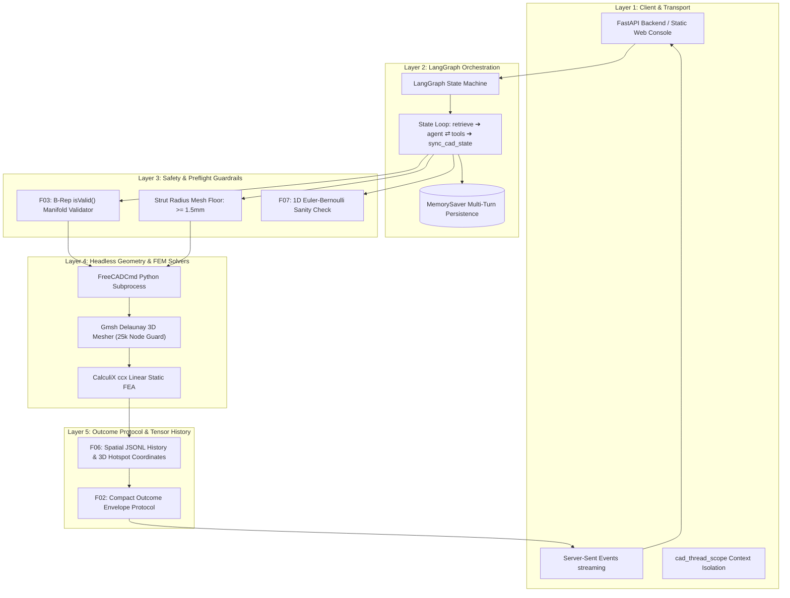

# CAD/FEA Companion — Engineering & AI Architecture Guide

This guide covers the complete technical architecture, AI engineering patterns, tool execution loops, geometric guardrails, and verification workflows powering the **CAD/FEA Companion**.

---

## 1. System Overview & AI Engineering Vision

The companion is an **agentic engineering assistant** that orchestrates parametric CAD generation, automated finite element analysis (FEA), and closed-loop structural optimization from natural language.

### Key Capabilities
1. **Domain-Specific RAG Grounding**: Local TF-IDF indexing over engineering markdown (`docs/`), grounding LLM responses in verified material data and mechanics formulas.
2. **ReAct Tool Planning**: Autonomous decomposition of user requests into sequential CAD generation, meshing, FEA solving, and trade-study tools.
3. **Stateful LangGraph Checkpointing**: Multi-turn conversation memory (`thread_id`) preserving CAD geometry, FEA tensor results, and parametric revisions across turns.
4. **Human-in-the-Loop (HITL)**: Optional interrupt gates before executing mutating CAD/FEA operations.
5. **Real-time SSE Streaming**: Live status narration as the agent moves between `retrieve` → `agent` ⇄ `tools`.

---

## 2. Multi-Layer AI & Solver Architecture



### Layer Breakdown

- **Layer 1: Client & Transport**: FastAPI backend with Server-Sent Events (SSE) streaming and ContextVar thread isolation (`cad_thread_scope`).
- **Layer 2: LangGraph Orchestration**: Stateful graph transitions (`retrieve` → `agent` ⇄ `tools` → `sync_cad_state`) with LangGraph `MemorySaver` multi-turn checkpointing.
- **Layer 3: Safety & Preflight Guardrails**: canonical pydantic tool-arg models that boundary-reject out-of-range `create_*` args at dispatch (`bad_params`, ADR-013 — the same models generate `TOOL_SPECS` and the program floors), F03 B-Rep `isValid()` manifold checks, strut radius floor enforcement ($\ge 1.5\text{ mm}$), and F07 Euler-Bernoulli beam theory preflight divergence checks.
- **Layer 4: Headless Geometry & FEM Solvers**: Headless `FreeCADCmd` Python subprocesses, Gmsh Delaunay mesher with 25k node guard, CalculiX `ccx` linear static FEA, and `os.killpg` process group isolation.
- **Layer 5: Outcome Protocol & Tensor History**: F02 flat-additive envelopes (`ok` + KPIs + `receipt`; on failure `error`, `error_class`, one `correction`), F06 spatial JSONL run history, and 3D tensor coordinate hotspot logging.

---

## 3. Flagship Geometry Families

| Geometry | Role | Design Space & Variants | Default Load |
| :--- | :--- | :--- | :--- |
| **Quadcopter UAV Arm (F26)** | Flagship Aerospace Part | Solid baseline vs 2.5D X-truss lattice with 1.5 mm solid chord rails (**~−17% mass**, 157 g → 130 g) | 120 N tip thrust |
| **Brake Pedal** | Automotive Bracket | Solid arm vs 2.5D X-truss vs FCC lattice web | +500 N footpad load (+X) |
| **Cantilever Beam** | Analytical Benchmark | 100×20×5 mm rectangular beam for closed-form verification | 100 N tip load |

---

## 4. AI Engineering Deep Dive: The 9 Core Features

### F01: Grounded RAG Knowledge Retrieval
- Ingests local technical documentation (`docs/materials.md`, `docs/freecad_fem_notes.md`) at startup.
- Grounds answers to material allowable questions (e.g. Al 6061-T6 yield strength: 276 MPa, E = 69.0 GPa) with citations.

### F02: Compact Outcome Envelope Protocol
- Tool outputs are a flat-additive envelope: success keeps KPIs plus a `receipt`; failure adds `error`, `error_class`, and one `correction`.
- Enforces strictly **one actionable error + one concrete correction**. Raw FreeCAD tracebacks are intercepted, preventing prompt context bloat.

### F03: B-Rep Geometry Guardrails
- Validates solid bodies before meshing (`isValid()`, watertight manifolds, self-intersection checks).
- Rejects geometric anomalies (e.g. strut radius exceeding cell radius, zero-height degenerate beams) prior to invoking expensive Gmsh or CCX solvers.

### F04: Transactional Parametric Design Programs
- The design program JSON is the **single source of truth**; CAD solid bodies and meshes are derived.
- Parameter updates are atomic. If a rebuild fails, the active revision is preserved.
- SHA-256 parameter hashing provides instant idempotency detection (`changed: false`).

### F06: Spatial Run History & Tensor Coordinates
- Every solve records full 3D spatial hotspot coordinates `(X, Y, Z)` alongside peak von Mises stress.
- Supports multi-run comparisons and logging in session JSONL history.

### F07: Closed-Form Analytical Preflight Sanity Checks
- Concurrently calculates 1D Euler-Bernoulli cantilever bending stress ($\sigma = \frac{6FL}{bh^2}$) to verify 3D CalculiX FEA results.
- Triggers divergence alerts if the FEA/analytical ratio falls outside the `[0.33, 3.0]` acceptance band.

### F08: Automated Mesh Convergence Studies
- Executes automated multi-density mesh sweeps (e.g., $5.0 \rightarrow 3.5 \rightarrow 2.5\text{ mm}$) using Gmsh.
- Calculates asymptotic stress deltas ($\Delta \le 5\%$) to verify discretization independence before engineering sign-off.

### F09: Multi-Criteria Material Reasoning Engine
- Generates side-by-side trade study comparison matrices (Al 6061-T6 vs Al 7075-T6 vs Ti-6Al-4V vs PA12 Nylon).
- **Solver Honesty**: Explicitly flags PA12 polymer displacement as `NOT VERIFIED` due to linear elastic solver limitations with viscoelastic creep.

### F26: Flagship Quadcopter UAV Arm
- End-to-end aerospace engineering workflow: rigid root clamp boss, motor ring interface, and internal generative 2.5D X-truss lightweighting.

---

## 5. Walkthrough: Full Aerospace UAV Arm Lifecycle

### Turn 1: Solid Baseline Creation & FEA Solve
- **Prompt**: *"Create a solid aluminum UAV arm and solve it under a 120 N tip thrust."*
- **Execution**: `create_uav_arm(web_type="solid")` → `apply_load_and_solve(force_n=120)`.
- **Result**: Mass **0.157 kg**, Peak von Mises **44.6 MPa**, Safety Factor **6.2** vs Al 6061-T6 yield.

### Turn 2: Generative Topology Lightweighting
- **Prompt**: *"Rebuild the UAV arm with a 2.5D X-truss lattice web with 12 mm cells, then re-solve."*
- **Execution**: `update_design_program(changes={"web_type": "xtruss", "cell_size_mm": 12.0})` → `apply_load_and_solve(force_n=120)`.
- **Result**: Mass drops by **~17%** (157 g → 130 g). Committed golden (`precomputed_demo_estimate` when live CalculiX is unavailable): peak von Mises **95 MPa**, safety factor **2.9** vs Al 6061-T6 yield (meets SF ≥ 1.5).

### Turn 3: Guardrail Floor Rejection (Preflight Safety)
- **Prompt**: *"Update the UAV arm strut radius to 0.8 mm."*
- **Execution**: `update_design_program(changes={"strut_radius_mm": 0.8})` intercepts validation error.
- **Result**: **Rejected**: Strut radius 0.8 mm is below the 1.5 mm meshable floor. Active revision 2 is preserved without disk corruption.

### Turn 4: Geometric Scaling
- **Prompt**: *"Increase the UAV arm length to 220 mm and solve under 120 N thrust."*
- **Execution**: `update_design_program(changes={"arm_length_mm": 220.0})` → `apply_load_and_solve(force_n=120)`.
- **Result**: Revision bumped to 3; mass and peak von Mises both increase with the longer moment arm (no committed golden at 220 mm).

---

## 6. Testing & Quality Gates

The repository includes a pytest suite (unit, integration, and headed Playwright browser tests):

### 1. Headed Playwright Browser UI Automation Suite
Runs in a visible Chromium desktop window against a zero-cost deterministic mock harness:
```bash
.venv/bin/python -m pytest tests/test_browser_ui.py -v
```
- **36 Isolated Prompts**: Tests every prompt card in the demo catalog.
- **9 Multi-Turn Continuous Journeys**: Tests iterative state mutation, error recovery, and domain boundaries.

### 2. Full Test Suite (Unit + Integration + Browser)
```bash
.venv/bin/python -m pytest tests/ -q
```
- Unit, integration, and Playwright tests covering the LangGraph graph, FreeCAD runtime, B-Rep validator, material engine, and browser console.

---

## 7. Interactive Demo Assets

All presentation and demo files are organized in the [`demo/`](../demo/) directory:
- [`demo/demo_catalog.html`](../demo/demo_catalog.html): Interactive Aerospace Simulation Console with 5-layer SVG architecture vector diagram and 3-column prompt teardowns.
- [`demo/DEMO_SCRIPT.md`](../demo/DEMO_SCRIPT.md): Step-by-step interview presentation guide.
- [`demo/Features.md`](../demo/Features.md): Comprehensive feature teardowns, pitches, scripts, and interview Q&A.
