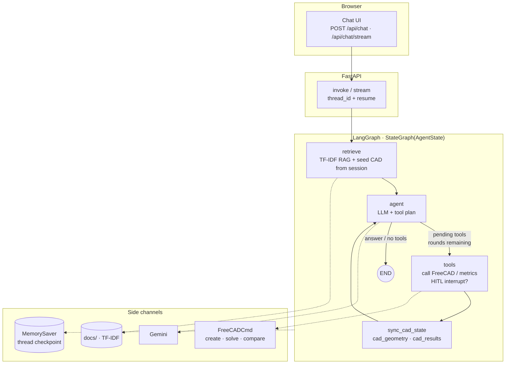

# Companion project notes

This repository implements a **local CAD/FEA chat companion**.

## Architecture in one sentence

Browser chat UI → FastAPI → LangGraph agent (`retrieve → agent ⇄ tools`, MemorySaver thread) → FreeCADCmd + local TF-IDF RAG, with Gemini as the LLM via `.env`.

## LangGraph architecture

Compiled graph in `companion/agent/graph.py`: entry at **retrieve**, then an **agent ⇄ tools** loop with CAD state sync, checkpointed by `MemorySaver` on `thread_id`. Optional HITL `interrupt()` on FreeCAD-mutating tools when `AGENT_REQUIRE_TOOL_CONFIRM=true`. Cap ≈ `agent_max_tool_rounds` (default 6).

On **retrieve**, if graph `cad_geometry` / `cad_results` are empty, the node copies them from the in-process FreeCAD session (`get_state()`). That keeps the agent aware of geometry already built in this server process even when the LangGraph checkpoint does not yet hold it.



**`AgentState` (key fields):** `messages` (`add_messages`), `citations`, `pending_tool_calls` / `tool_results`, `cad_geometry` / `cad_results`, `answer`, `iteration`.

```text
  user message
       │
       ▼
  ┌─────────┐     citations
  │ retrieve │◄──────────────── docs/ (TF-IDF)
  │          │     also: seed empty cad_* from FreeCAD session
  └────┬────┘
       ▼
  ┌─────────┐     tool calls          ┌──────────────┐
  │  agent  │────────────────────────►│    tools     │──► FreeCAD / metrics
  └────┬────┘◄────────────────────────│ sync_cad_…   │
       │         observations         └──────────────┘
       │ no more tools (or max rounds)
       ▼
      END  (+ MemorySaver checkpoint for next turn)
```

## LangGraph topics

| Idea | Plain version |
|------|---------------|
| Tool loop | Try a tool → see what happened → maybe try another |
| Memory | Remember earlier turns (`thread_id` + checkpointer) |
| CAD in graph state | Remember “we already built the brake pedal” |
| HITL | Ask “OK to open FreeCAD?” (`AGENT_REQUIRE_TOOL_CONFIRM`) |
| Streaming | Narrate meshing/solving (`POST /api/chat/stream`) |

## Primary workflow

Primary part: **brake-pedal bracket** with solid skins + X-truss/FCC lattice web (see `DEMO.md`).

1. Ask Al 6061-T6 yield / lattice relative density → RAG citations.
2. Create **solid** brake pedal → solve +500 N footpad load along +X → mass / σ / δ.
3. Create **X-truss** web → solve → mass↓ vs stress/stiffness tradeoff.
4. `compare_brake_pedal_variants` → lightest with SF ≥ 1.5.
5. Show `pytest tests/` and/or `eval/cases.json` pass/fail.

Engine-mount and cantilever tools remain for secondary / regression paths.

## Quality commands

```bash
.venv/bin/python -m pytest tests/ -q
.venv/bin/python eval/run_eval.py
```

## Mesh and memory

- Coarse mesh only (~5 mm on pedal; &lt;25k nodes).
- One FreeCAD process at a time.
- Prefer precomputed JSON (`brake_pedal_*_precomputed.json`) if the live solve stalls.
